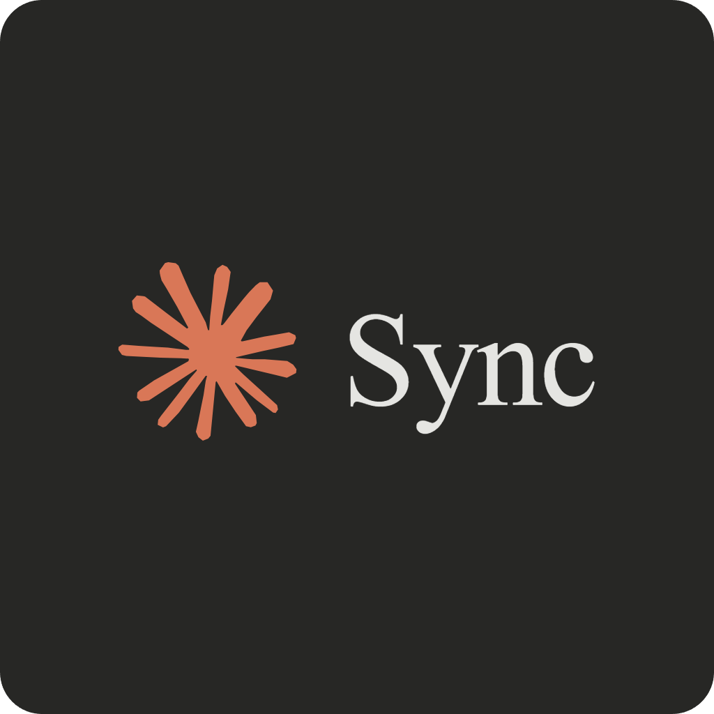

<!-- LOGO -->
<h1>
<p align="center">
  
  <br>ClaudeSync
</h1>
  <p align="center">
    Sync your code easily with Claude.ai Projects without leaving your IDE.
    <br />
    <a href="https://marketplace.visualstudio.com/items?itemName=rexdotsh.claudesync">Download</a>
    ·
    <a href="#quick-start-guide">Quick Start</a>
    ·
    <a href="#configuration">Configuration</a>
  </p>
</p>

## About

One of the most underrated features of Claude.ai is "projects". You can sync your code with a project, and then simply talk to Claude about your code, without needing to worry about supplying context. ChatGPT has a similar feature, but only works with their "4o" model as of now, and is not as good as Claude.

Claude Sync aims to make it easier to use Claude.ai projects by directly letting you sync your code from your IDE, with features like auto-syncing, exclude/include files, and more.

> Inspired by [ClaudeSync](https://github.com/jahwag/ClaudeSync) by jahwag.

## Quick Start Guide

> [!NOTE]
> This extension requires a Claude.ai account with the **Pro** plan.

### 1. Install the Extension

You can install ClaudeSync directly from the [VS Code Marketplace](https://marketplace.visualstudio.com/items?itemName=rexdotsh.claudesync)!

### 2. Get Your Claude Token

To connect ClaudeSync with your Claude.ai account, you'll need your session token. Here's how to get it:

1. Visit [claude.ai](https://claude.ai) and sign in to your account.
2. Open Developer Tools:
   - Windows/Linux: `F12` or `Ctrl+Shift+I`
   - Mac: `Cmd+Option+I`
3. Navigate to: `Application → Cookies → claude.ai → sessionKey`
4. Copy the token value (starts with "sk-ant")

> Tip: Make sure you copy the raw token value, not the URL-encoded version!

### 3. Configure the Extension

1. Open the Command Palette in VS Code:
   - Windows/Linux: `Ctrl+Shift+P`
   - Mac: `Cmd+Shift+P`
2. Type "ClaudeSync: Set Token"
3. Paste your Claude session token
4. You're ready to go!

## Available Commands

Access these commands through the Command Palette (`Ctrl+Shift+P` or `Cmd+Shift+P`):

| Command                                     | Description                                   |
| ------------------------------------------- | --------------------------------------------- |
| `ClaudeSync: Set Token`                     | Configure your Claude session token           |
| `ClaudeSync: Initialize Project`            | Set up a new Claude project for the workspace |
| `ClaudeSync: Sync Current File`             | Sync the active file                          |
| `ClaudeSync: Sync Workspace`                | Sync all workspace files                      |
| `ClaudeSync: Configure Auto-sync`           | Manage automatic file syncing                 |
| `ClaudeSync: Configure Startup Sync`        | Control syncing on VS Code startup            |
| `ClaudeSync: Sync Project Instructions`     | Update project instructions                   |
| `ClaudeSync: Open in Browser`               | View project in Claude.ai's Web UI            |
| `ClaudeSync: Configure Remote File Cleanup` | Configure cleanup of remote files             |
| `ClaudeSync: Show Current Settings`         | Display current extension settings            |
| `ClaudeSync: Exclude from Sync`             | Exclude specific files from syncing           |
| `ClaudeSync: Include in Sync`               | Include previously excluded files in syncing  |
| `ClaudeSync: Show Output Channel`           | Show the extension's output/logs              |
| `ClaudeSync: Update Project Instructions`   | Update project instructions in Claude.ai      |
| `ClaudeSync: Toggle Auto-Add to Gitignore`  | Toggle automatic .gitignore management        |

## Configuration

Customize ClaudeSync through `.vscode/claudesync.json` for workspace settings and VS Code's settings for global options:

```json
{
  "excludePatterns": [
    "node_modules/**",
    ".git/**",
    "dist/**",
    "build/**",
    "**/*.pyc",
    "**/__pycache__/**",
    ".env"
    // ... many other patterns
  ],
  "maxFileSize": 2097152, // 2MB
  "autoSync": false,
  "autoSyncInterval": 30,
  "syncOnStartup": false,
  "cleanupRemoteFiles": false
}
```

### Configuration Options

| Option               | Description                                             | Default           | Scope     |
| -------------------- | ------------------------------------------------------- | ----------------- | --------- |
| `sessionToken`       | Claude.ai session token for authentication              | `""`              | Global    |
| `addToGitignore`     | Automatically add claudesync.json to .gitignore         | `true`            | Global    |
| `excludePatterns`    | Glob patterns for excluded files                        | See example above | Workspace |
| `maxFileSize`        | Maximum file size in bytes                              | `2097152` (2MB)   | Workspace |
| `autoSync`           | Enable automatic file syncing                           | `false`           | Workspace |
| `autoSyncInterval`   | Delay in seconds between auto-syncs (min: 10, max: 180) | `30`              | Workspace |
| `syncOnStartup`      | Sync workspace when VS Code starts                      | `false`           | Workspace |
| `cleanupRemoteFiles` | Remove remote files that don't exist locally            | `false`           | Workspace |

## Project Instructions

Need to give Claude specific instructions for your project? Create a `.projectinstructions` file in your workspace root. These instructions sync when initializing a new project, or when running "Sync Project Instructions" manually.

## Contributing

Feel free to contribute to this project by opening an issue or submitting a pull request.

## License

ClaudeSync is open source software licensed under the MIT License. See the [LICENSE](LICENSE) file for details.

---

> [!WARNING]
> This extension is not officially affiliated with Anthropic's Claude.ai service.
